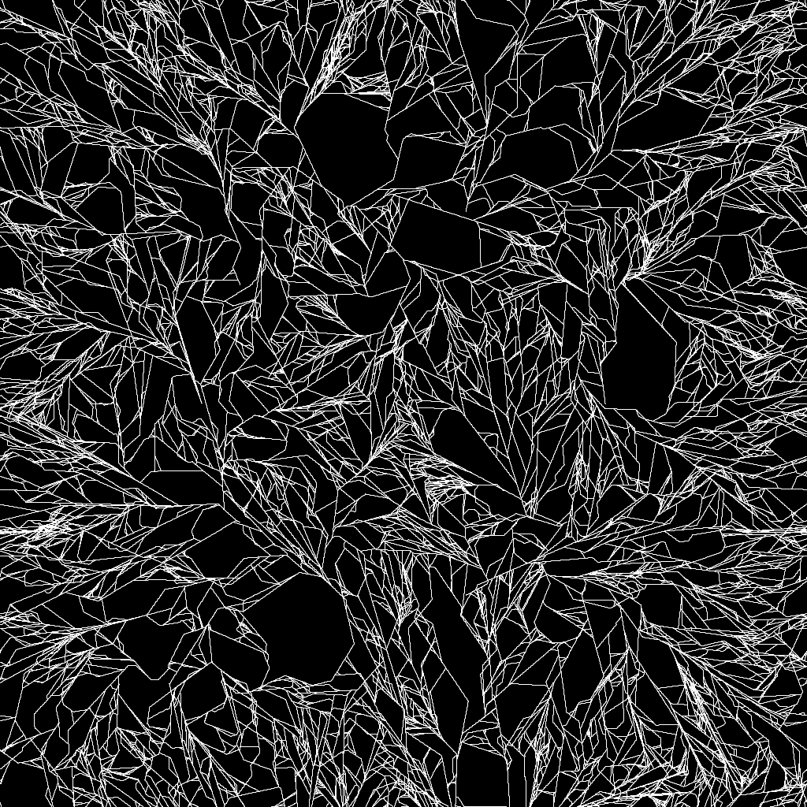
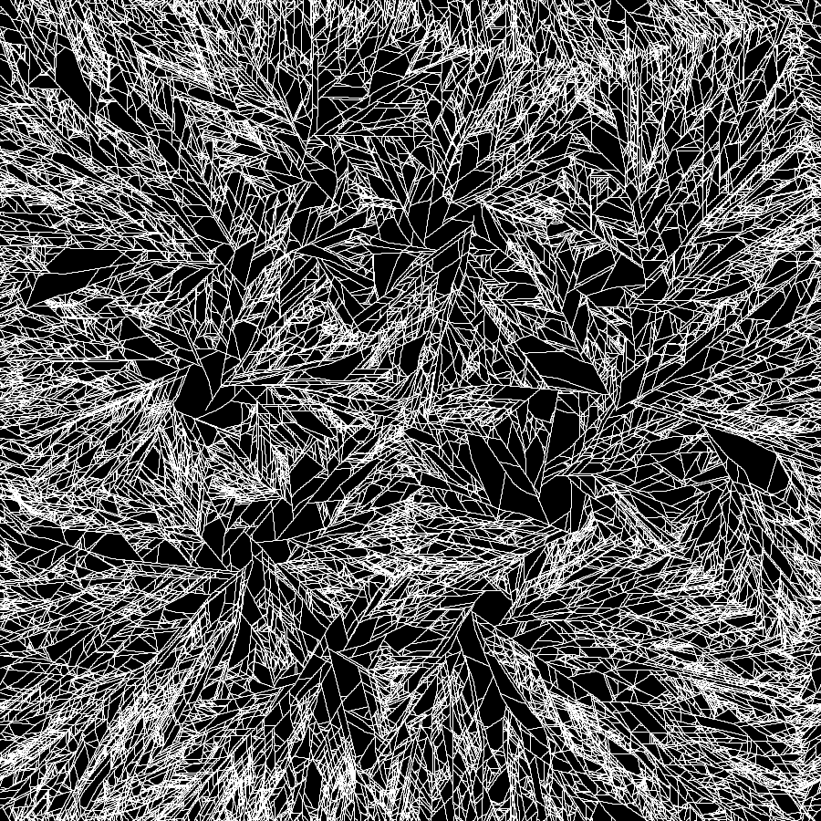
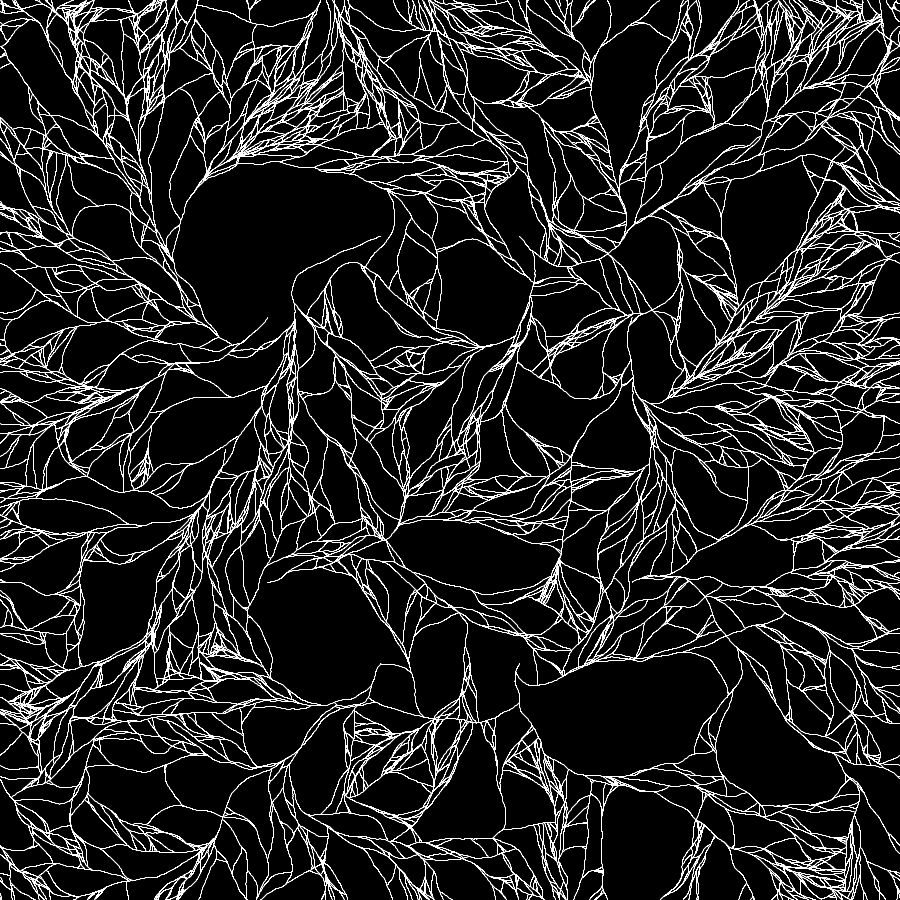
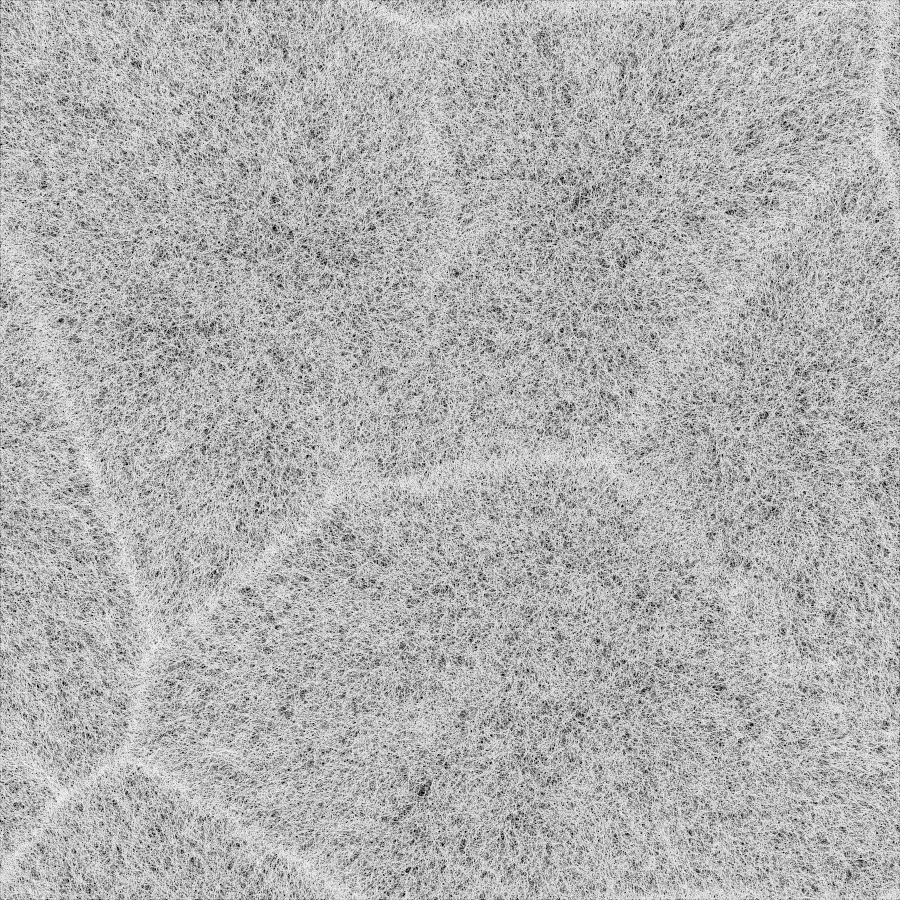
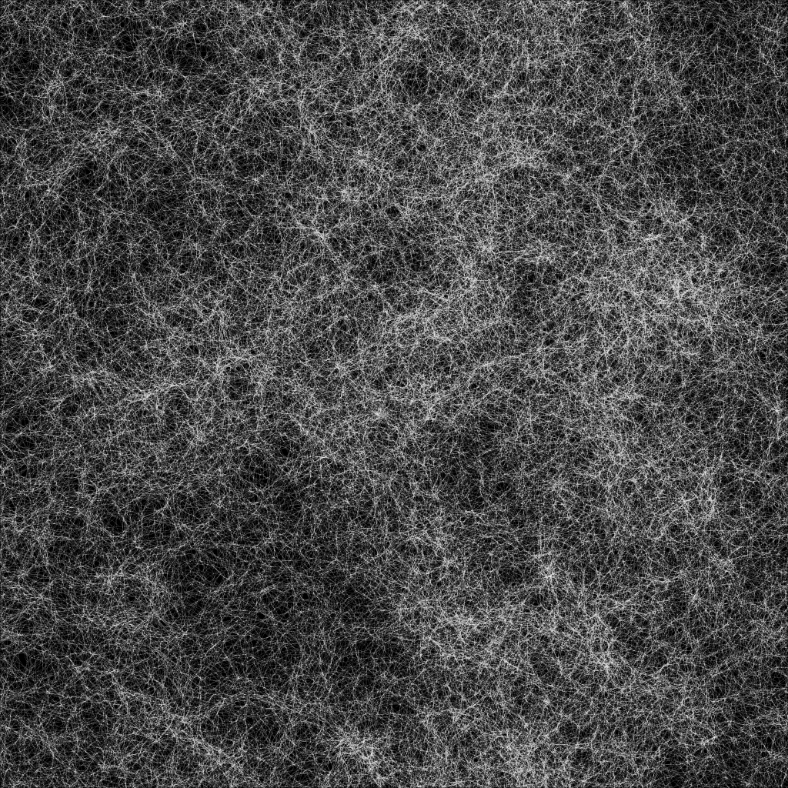

Dividing-Aggregating Walkers
========

This technique allows for the generation of many different natural looking patterns using random walkers. The technique is described in great details in [an article on my blog](https://ciphrd.com/?p=1076).

# How does it work

* **Walking step**: a walker moves by a discrete step and has some chances to turn by a discrete angle.
* **Deposit step**: by moving, the walker leaves some substrate in the environment
* **Division step**: a walker has some chances to replicate itself, with only a variation in its angle
* **Termination step**: if a walker runs into some aggregated substrate, it dies

# Examples

